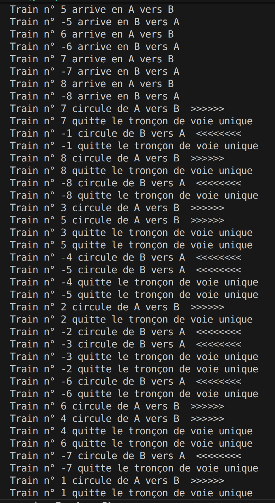
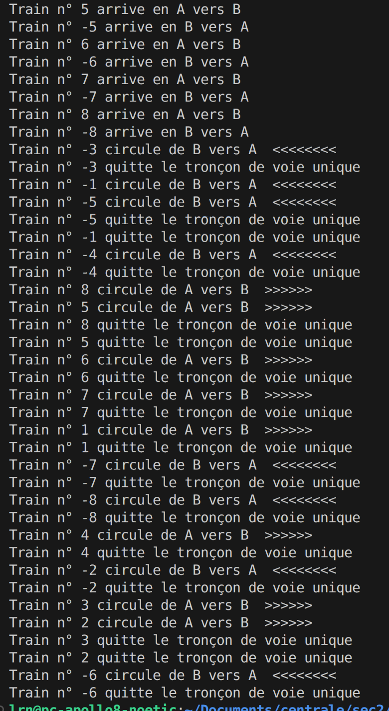

# TP5 PTR
------ Cousseau Yanis x Bernier Laurène ------

# Partie ecrivain-lecteur
## Q 1

### Code 
```cpp
#include <iostream>           
#include <thread>             
#include "Semaphore.hpp"

int ressourcePartagee;
Semaphore sem = Semaphore(5);
Semaphore muex = Semaphore(1);
Semaphore ecrit = Semaphore(1);
int l;

void lecteur(int numLecteur){
  for (int i = 0; i < 4; i++){
    std::cout << "Lecteur n° " << numLecteur << " en cours " << endl;
    this_thread::sleep_for(chrono::milliseconds(rand() % 20000) );
    std::cout << "        Valeur lue = " << ressourcePartagee << "  " << endl;
    muex.P();
    l++;
    if(l==1) ecrit.P();
    muex.V();
    cout<<"Le lecteur lit : "<<ressourcePartagee<<"."<<endl;
    muex.P();
    l--;
    if(l==0) ecrit.V();
    muex.V();
  }
}

void ecrivain(int numEcrivain){
  int x;
  for (int i = 0; i < 4; i++){
    std::cout << "Ecrivain n° " << numEcrivain << " en cours " << endl;
    x = ressourcePartagee;
    this_thread::sleep_for(chrono::milliseconds(rand() % 20000) );
    std::cout << "valeur à incrémenter de la ressourcePartagee = " << x << "  " << endl;
    
    ecrit.P();
    ressourcePartagee = x+1 ;
    ecrit.V();
  }
}

int main() {
  const int nbr = 8;
  std::thread r[nbr];
  std::thread w[nbr];
  int ressourcePartagee = 0;

  for (int i = 1; i < nbr; i++){
    r[i] = std::thread(lecteur, -i);
    w[i] = std::thread(ecrivain, i);
  }
// Join des threads 
  for (int i = 1; i < nbr; i++) {
  r[i].join(); 
  w[i].join();   
  }
  return 0;
}
```

### Essai


# Partie train

## Q 2.1

### Code 
```cpp
```

### Essai


## Q 2.2

### Code
```cpp
#ifndef CONTROLEUR_HPP
#define CONTROLEUR_HPP

#include <thread>             
#include <iostream>
#include <mutex>
#include <condition_variable>

using namespace std; 


class Controleur {
  private:
  mutex acces;
  bool trainPresent = false;
  int numPrecedent = 0;
  int nbtrainEngage = 0;
  bool autorisation = false;

  public:
    Controleur (int valeur_initiale) : 
    val(valeur_initiale)
    {
    }
    
    bool controlinEnB(int numero) { 
        if(trainPresent == false || (trainPresent == true && numPrecedent<0 && autorisation == true)) {
          trainPresent = true;
          nbtrainEngage++;
          if(nbtrainEngage == 2){
            autorisation = false;
          }
          numPrecedent = numero;
          return true;
        } 
        else {
          return false;
        }
    }  

    bool controlinEnA(int numero) {
      if(trainPresent == false || (trainPresent == true && numPrecedent>0 && autorisation == true)) {
        nbtrainEngage++;
        trainPresent = true;
        if(nbtrainEngage == 2){
          autorisation = false;
        }
        numPrecedent = numero;
        return true;
      } 
      else {
        return false;
      }
    }  

    bool controloutEnB(int numero){
      nbtrainEngage--;
      if(nbtrainEngage == 0){
        trainPresent = false; // pas de train
        autorisation = true;
      }
      return trainPresent;
    }

    bool controloutEnA(int numero){ 
      nbtrainEngage--;
      if(nbtrainEngage == 0){
        trainPresent = false; // pas de train
        autorisation = true;
      } 
      return trainPresent;
    }

  private:
    int val;
};

#endif //CONTROLEUR_HPP

```

### Essai



## Q 2.3
### Code
```cpp
#ifndef CONTROLEUR_HPP
#define CONTROLEUR_HPP

#include <thread>             
#include <iostream>
#include <mutex>
#include <condition_variable>

using namespace std; 


class Controleur {
  private:
  mutex acces;
  bool trainPresent = false;
  int numPrecedent = 0;
  int nbtrainEngage = 0;
  bool autorisation1 = false;
  bool autorisation2 = false;
  int sensA = 0;
  int sensB = 0;
  int nbtchoutchouA = 0;
  int nbtchoutchouB = 0;

  public:
    Controleur (int valeur_initiale) : 
    val(valeur_initiale)
    {
    }
    
    bool controlinEnB(int numero) {
      if(sensB < 2 && nbtchoutchouB < 3){
        autorisation2 = true;
      }
      if(trainPresent == false || (trainPresent == true && numPrecedent<0 && autorisation1 == true && autorisation2 == true)) {
        trainPresent = true;
        nbtrainEngage++;
        sensB++;
        nbtchoutchouB++;
        sensA=0;
        nbtchoutchouA=0;
        if(nbtrainEngage == 2){
          autorisation1 = false;
        }
        numPrecedent = numero;
        return true;
      } 
      else {
        return false;
      }
    }  

    bool controlinEnA(int numero) {
      if(sensA < 2 && nbtchoutchouA < 3){
        autorisation2 = true;
      }
      if(trainPresent == false || (trainPresent == true && numPrecedent>0 && autorisation1 == true && autorisation2 == true)) {
        nbtrainEngage++;
        sensA++;
        nbtchoutchouA++;
        sensB=0;
        nbtchoutchouB=0;
        trainPresent = true;
        if(nbtrainEngage == 2){
          autorisation1 = false;
        }
        numPrecedent = numero;
        return true;
      } 
      else {
        return false;
      }
    }  

    bool controloutEnB(int numero){
      nbtrainEngage--;
      if(nbtrainEngage == 0){
        trainPresent = false; // pas de train
        autorisation1 = true;
      }
      return trainPresent;
    }

    bool controloutEnA(int numero){ 
      nbtrainEngage--;
      if(nbtrainEngage == 0){
        trainPresent = false; // pas de train
        autorisation1 = true;
      } 
      return trainPresent;
    }

  private:
    int val;
};

#endif //CONTROLEUR_HPP

```

### Essai


