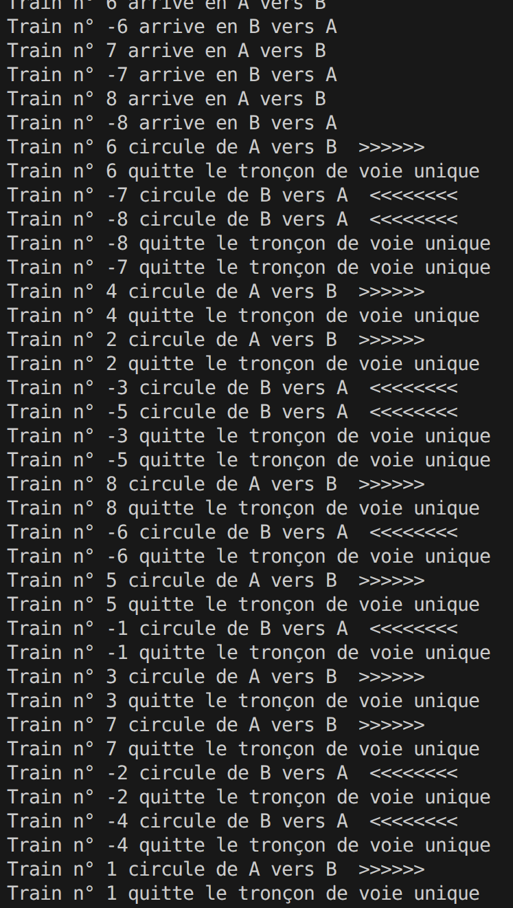

# TP5 PTR
------ Cousseau Yanis x Bernier Laurène ------

# Partie ecrivain-lecteur
## Q 1

### Code 
```cpp
int ressourcePartagee;
Semaphore sem = Semaphore(5);
Semaphore muex = Semaphore(1);
Semaphore ecrit = Semaphore(1);
int l;

void lecteur(int numLecteur){
  for (int i = 0; i < 4; i++){
    std::cout << "Lecteur n° " << numLecteur << " en cours " << endl;
    this_thread::sleep_for(chrono::milliseconds(rand() % 20000) );
    std::cout << "        Valeur lue = " << ressourcePartagee << "  " << endl;
    muex.P();
    l++;
    if(l==1) ecrit.P();
    muex.V();
    cout<<"Le lecteur lit : "<<ressourcePartagee<<"."<<endl;
    muex.P();
    l--;
    if(l==0) ecrit.V();
    muex.V();
  }
}

void ecrivain(int numEcrivain){
  int x;
  for (int i = 0; i < 4; i++){
    std::cout << "Ecrivain n° " << numEcrivain << " en cours " << endl;
    x = ressourcePartagee;
    this_thread::sleep_for(chrono::milliseconds(rand() % 20000) );
    std::cout << "valeur à incrémenter de la ressourcePartagee = " << x << "  " << endl;
    
    ecrit.P();
    ressourcePartagee = x+1 ;
    ecrit.V();
  }
}
```

### Test


# Partie train

## Q 2.1

### Code 
```cpp
class Controleur {
  private:
  mutex acces;
  bool trainPresent = false;
  int numPrecedent = 0;
  int nbtrainEngage = 0;

  public:
    Controleur (int valeur_initiale) : 
    val(valeur_initiale)
    {
    }
    
    bool controlinEnB(int numero) { 
        if(trainPresent == false || (trainPresent == true && numPrecedent<0)) {
          trainPresent = true;
          nbtrainEngage++;
          
          numPrecedent = numero;
          return true;
        } 
        else {
          return false;
        }
    }  

    bool controlinEnA(int numero) {
      if(trainPresent == false || (trainPresent == true && numPrecedent>0)) {
        nbtrainEngage++;
        trainPresent = true;
        
        numPrecedent = numero;
        return true;
      } 
      else {
        return false;
      }
    }  

    bool controloutEnB(int numero){
      nbtrainEngage--;
      if(nbtrainEngage == 0){
        trainPresent = false; // pas de train
      }
      return trainPresent;
    }

    bool controloutEnA(int numero){ 
      nbtrainEngage--;
      if(nbtrainEngage == 0){
        trainPresent = false; // pas de train
      } 
      return trainPresent;
    }

  private:
    int val;
};
```

### Test



## Q 2.2

### Code
```cpp
class Controleur {
  private:
  mutex acces;
  bool trainPresent = false;
  int numPrecedent = 0;
  int nbtrainEngage = 0;
  bool autorisation = false;

  public:
    Controleur (int valeur_initiale) : 
    val(valeur_initiale)
    {
    }
    
    bool controlinEnB(int numero) { 
        if(trainPresent == false || (trainPresent == true && numPrecedent<0 && autorisation == true)) {
          trainPresent = true;
          nbtrainEngage++;
          if(nbtrainEngage == 2){
            autorisation = false;
          }
          numPrecedent = numero;
          return true;
        } 
        else {
          return false;
        }
    }  

    bool controlinEnA(int numero) {
      if(trainPresent == false || (trainPresent == true && numPrecedent>0 && autorisation == true)) {
        nbtrainEngage++;
        trainPresent = true;
        if(nbtrainEngage == 2){
          autorisation = false;
        }
        numPrecedent = numero;
        return true;
      } 
      else {
        return false;
      }
    }  

    bool controloutEnB(int numero){
      nbtrainEngage--;
      if(nbtrainEngage == 0){
        trainPresent = false; // pas de train
        autorisation = true;
      }
      return trainPresent;
    }

    bool controloutEnA(int numero){ 
      nbtrainEngage--;
      if(nbtrainEngage == 0){
        trainPresent = false; // pas de train
        autorisation = true;
      } 
      return trainPresent;
    }

  private:
    int val;
};
```

### Test


## Q 2.3

### Code

```cpp
class Controleur {
  private:
  mutex acces; /** Mutex protégeant l'état interne du contrôleur */
  bool trainPresent = false; /** Indique si au moins un train est présent dans la section critique */
  /**
     * Numéro du dernier train autorisé.
     * Le signe du numéro est utilisé pour déterminer le sens précédent.
     */
  int numPrecedent = 0;
  int nbtrainEngage = 0; /** Nombre de trains actuellement engagés dans la section critique */
  bool autorisation1 = false; /** Autorisation principale de passage */
  bool autorisation2 = false; /** Autorisation secondaire liée aux conditions de sens */
  int sensA = 0; /** Nombre de trains consécutifs passés en sens A */
  int sensB = 0; /** Nombre de trains consécutifs passés en sens B */
  int nbtchoutchouA = 0; /** Nombre total de trains autorisés en sens A */
  int nbtchoutchouB = 0; /** Nombre total de trains autorisés en sens B */
  int filedAttenteA = 0; 
  int filedAttenteB = 0;

  public:
    Controleur (int valeur_initiale) : 
    val(valeur_initiale)
    {
    }
    

    bool controlinEnB(int numero) {
      // Si le quota de passages consécutifs en sens B n'est pas dépassé
      // ET qu'il n'y a pas de train en attente en sens A-B,
      // alors on autorise le passage en sens B-A
      if(sensB < 2 && (nbtchoutchouB < 3 && filedAttenteA==0)){
        autorisation2 = true;
      }
      // Cas où la section est libre : autorisation immédiate
      // OU
      // cas où un train est déjà présent mais le sens est cohérent
      // avec le précédent et les autorisations sont valides
      if(trainPresent == false || (trainPresent == true && numPrecedent<0 && autorisation1 == true && autorisation2 == true)) {
        filedAttenteB--;
        trainPresent = true;
        nbtrainEngage++;
        sensB++;
        nbtchoutchouB++;
        sensA=0;
        nbtchoutchouA=0;
        // Limitation du nombre de trains simultanés
        if(nbtrainEngage == 2){
          autorisation1 = false;
        }
        numPrecedent = numero;
        return true;
      } 
      else {
        // Cas refusé : le train reste en attente
        filedAttenteB++;
        return false;
      }
    }  


    bool controlinEnA(int numero) {
      // Même logique que controlinEnB, appliquée au sens A
      // Les règles d'équité et de limitation sont symétriques

      // Si le quota de passages consécutifs en sens B n'est pas dépassé
      // ET qu'il n'y a pas de train en attente en sens B-A,
      // alors on autorise le passage en sens A-B
      if(sensA < 2 && (nbtchoutchouA < 3 && filedAttenteB==0)){
        autorisation2 = true;
      }
      // Cas où la section est libre : autorisation immédiate
      // OU
      // cas où un train est déjà présent mais le sens est cohérent
      // avec le précédent et les autorisations sont valides
      if(trainPresent == false || (trainPresent == true && numPrecedent>0 && autorisation1 == true && autorisation2 == true)) {
        filedAttenteA --;
        nbtrainEngage++;
        sensA++;
        nbtchoutchouA++;
        sensB=0;
        nbtchoutchouB=0;
        trainPresent = true;
        // Limitation du nombre de trains simultanés
        if(nbtrainEngage == 2){
          autorisation1 = false;
        }
        numPrecedent = numero;
        return true;
      } 
      else {
        // Cas refusé : le train reste en attente
        filedAttenteA++;
        return false;
      }
    }  


    bool controloutEnB(int numero){
      nbtrainEngage--;
      // Si plus aucun train n'est engagé,
      // la section est libérée et les autorisations sont réinitialisées
      if(nbtrainEngage == 0){
        trainPresent = false; // pas de train
        autorisation1 = true; // Réautorise l'accès pour les trains suivants
      }
      return trainPresent;
    }


    bool controloutEnA(int numero){ 
      nbtrainEngage--;
      if(nbtrainEngage == 0){
        trainPresent = false; // pas de train
        autorisation1 = true;
      } 
      return trainPresent;
    }

  private:
    int val;
};
```

### Test


